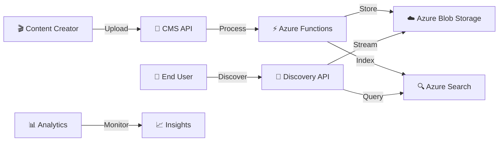
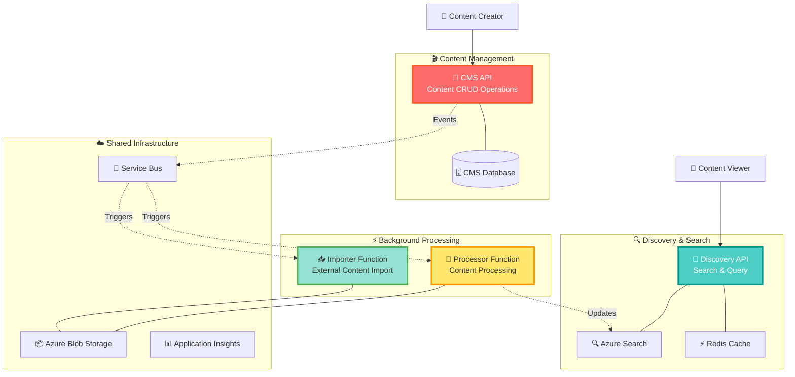
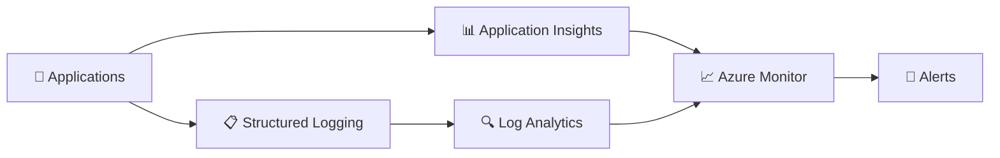
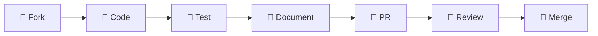

<div align="center">

# 🎭 **ScenariosWHwar** 🎪

### _What Would Happen_ - Episode Content Management & Discovery Platform

<p align="center">
  
  
  
  
</p>

<p align="center">
  
  
  
  
</p>

---

### 🌟 _"Discover, Manage, and Experience Episodes Like Never Before!"_ 🌟

</div>

```ascii
    ╔══════════════════════════════════════════════════════════════╗
    ║  🎬 EPISODE MANAGEMENT    📱 DISCOVERY API    ⚡ FUNCTIONS   ║
    ║                                                              ║
    ║  🔍 Smart Search         🎯 Content Import    📊 Analytics   ║
    ║  🎨 Rich Media          🔄 Auto Processing   🚀 Real-time    ║
    ║  🌐 Multi-language      📈 Performance       🛡️ Secure      ║
    ╚══════════════════════════════════════════════════════════════╝
```

---

## 📖 Table of Contents

- [🎯 What is ScenariosWHwar?](#-what-is-scenarioswhwar)
- [✨ Spectacular Features](#-spectacular-features)
- [�️ Architecture Overview](#️-architecture-overview)
- [🚀 Quick Start Guide](#-quick-start-guide)
- [� API Playground](#-api-playground)
- [� Monitoring & Observability](#-monitoring--observability)
- [🔧 Development Setup](#-development-setup)
- [🤝 Contributing](#-contributing)

## 🎯 What is ScenariosWHwar?

> **"What Would Happen"** - Explore infinite possibilities through episodic content! 🌟

**ScenariosWHwar** is a cutting-edge **Episode Content Management and Discovery Platform** that revolutionizes how educational and entertainment content is created, managed, and consumed. Built with modern cloud-native architecture, it provides a seamless experience for content creators and viewers alike.

<div align="center">



</div>

### 🌈 **Core Domains**

| Domain            | Description                   | Key Features                                                       |
| ----------------- | ----------------------------- | ------------------------------------------------------------------ |
| 🎬 **Episodes**   | Rich media content management | Multi-format support, Auto-processing, Metadata enrichment         |
| 🔍 **Discovery**  | Intelligent content search    | AI-powered search, Faceted filtering, Real-time indexing           |
| 📱 **CMS**        | Content management system     | CRUD operations, Workflow management, Bulk operations              |
| ⚡ **Processing** | Background content processing | Video/Audio processing, Thumbnail generation, Quality optimization |

---

## ✨ Spectacular Features

<details>
<summary>🎨 <strong>Rich Content Management</strong></summary>

- 🎥 **Multi-format Support**: Video (MP4, AVI, MOV), Audio (MP3, WAV, AAC), Documents
- 🌍 **Multi-language**: Arabic, English, and more with automatic detection
- 📊 **Metadata Enrichment**: Automatic title extraction, description generation, categorization
- 🎯 **Smart Categories**: Technology, Culture, History, Science, Politics, Sports, Entertainment, Education, Business, Health

</details>

<details>
<summary>🔍 <strong>Intelligent Discovery</strong></summary>

- ⚡ **Lightning-fast Search**: Azure Cognitive Search powered with sub-second responses
- 🎯 **Faceted Navigation**: Filter by category, language, duration, publish date
- 📱 **Mobile-optimized**: Responsive design for all devices
- 🔄 **Real-time Updates**: Live search results as content is published

</details>

<details>
<summary>🏗️ <strong>Modern Architecture</strong></summary>

- 🎯 **Vertical Slice Architecture**: Domain-driven, feature-focused organization
- ⚡ **Minimal APIs**: Fast, lightweight endpoints with OpenAPI documentation
- � **CQRS + MediatR**: Clear separation of reads and writes
- 📦 **Domain Events**: Loosely coupled, event-driven communication

</details>

<details>
<summary>☁️ <strong>Cloud-Native Excellence</strong></summary>

- � **Azure Functions**: Serverless background processing
- 📊 **Azure Storage**: Scalable blob storage for media files
- 🔍 **Azure Search**: Enterprise-grade search capabilities
- � **Redis Cache**: High-performance caching layer
- 🛡️ **Application Insights**: Comprehensive monitoring and analytics

</details>

<details>
<summary>🔧 <strong>Developer Experience</strong></summary>

- � **Strongly Typed IDs**: Combat primitive obsession with type safety
- ✅ **FluentValidation**: Comprehensive input validation
- 📋 **Specification Pattern**: Testable, reusable query logic
- 🧪 **Comprehensive Testing**: Unit, Integration, and Architecture tests
- 📚 **Rich Documentation**: OpenAPI/Scalar integration

</details>

---

## 🏗️ Architecture Overview

<div align="center">

### 🎪 **Microservices Ecosystem**

</div>



### 🎯 **Key Architectural Patterns**

<table>
<tr>
<td width="50%">

#### 🏗️ **Vertical Slice Architecture**

```
📁 Features/
├── 🎬 Episodes/
│   ├── Commands/
│   ├── Queries/
│   └── EventHandlers/
├── 🔍 Search/
│   ├── Commands/
│   └── Queries/
└── 📊 Analytics/
    └── Queries/
```

</td>
<td width="50%">

#### 🔄 **Event-Driven Architecture**

```
📈 Domain Events:
├── 🎬 EpisodeCreated
├── 📝 EpisodeUpdated
├── 🗑️ EpisodeDeleted
├── 🔄 StatusChanged
└── 📁 BlobPathUpdated
```

</td>
</tr>
</table>

---

## 🚀 Quick Start Guide

### 🛠️ **Prerequisites**

<div align="center">

| Tool             | Version | Purpose                   |
| ---------------- | ------- | ------------------------- |
| 🐳 **Docker**    | Latest  | Container orchestration   |
| ⚡ **.NET**      | 9.0+    | Runtime environment       |
| ☁️ **Azure CLI** | Latest  | Cloud resource management |

</div>

### 🚀 **Lightning Setup** ⚡

```powershell
# 1️⃣ Clone the magic ✨
git clone https://github.com/SSWConsulting/ScenarioWHwar.git
cd ScenarioWHwar

# 2️⃣ Fire up the engines 🚀
cd src/ScenariosWHwar.API/ScenariosWHwar.CMS.API
dotnet run

# 3️⃣ Launch discovery portal 🔍
cd ../ScenariosWHwar.Discovery.API
dotnet run

# 4️⃣ Start background processing ⚡
cd ../../ScenariosWHwar.Functions/ScenariosWHwar.Importer.Function
func start
```

<div align="center">

### 🎉 **You're Ready!** 🎉


</div>

---

## 🎮 API Playground

### 🎬 **CMS API Endpoints**

<details>
<summary>📝 <strong>Episode Management</strong></summary>

```http
### Create Episode
POST https://localhost:7001/api/episodes
Content-Type: application/json

{
  "title": "🎯 Advanced .NET Patterns",
  "description": "Deep dive into advanced patterns and practices",
  "category": "Technology",
  "format": "mp4",
  "language": "en",
  "duration": 3600
}

### Get Episode
GET https://localhost:7001/api/episodes/{id}

### Update Episode
PUT https://localhost:7001/api/episodes/{id}

### Delete Episode
DELETE https://localhost:7001/api/episodes/{id}
```

</details>

### 🔍 **Discovery API Endpoints**

<details>
<summary>🔎 <strong>Search & Discovery</strong></summary>

```http
### Search Episodes
GET https://localhost:7002/api/episodes/search
  ?query=.NET
  &category=Technology
  &language=en
  &page=1
  &size=20

### Get Episode by ID
GET https://localhost:7002/api/episodes/{id}

### Get Popular Episodes
GET https://localhost:7002/api/episodes/popular
  ?category=Technology
  &limit=10
```

</details>

---

## 📊 Monitoring & Observability

<div align="center">

### � **Real-time Insights Dashboard**

</div>

<table>
<tr>
<td width="33%">

#### 📈 **Performance Metrics**

- ⚡ API Response Times
- 🔍 Search Query Performance
- 📦 Storage Usage
- 🔄 Processing Queue Status

</td>
<td width="33%">

#### 🛡️ **Health Monitoring**

- 💓 Service Health Checks
- 🌐 Endpoint Availability
- 📊 Database Connectivity
- ☁️ Azure Service Status

</td>
<td width="33%">

#### 🎯 **Business Metrics**

- 👥 Active Users
- 🎬 Episodes Created
- 🔍 Search Queries
- 📈 Content Consumption

</td>
</tr>
</table>

### 🔍 **Monitoring Stack**



---

## 🔧 Development Setup

### 🛠️ **Advanced Development Setup**

<details>
<summary>🔧 <strong>Local Development Environment</strong></summary>

#### 1️⃣ **Environment Configuration**

```powershell
# Copy environment templates
cp appsettings.Development.template.json appsettings.Development.json

# Configure local secrets
dotnet user-secrets init
dotnet user-secrets set "ConnectionStrings:DefaultConnection" "Data Source=localhost;Initial Catalog=ScenariosWHwar;Integrated Security=true"
dotnet user-secrets set "AzureStorage:ConnectionString" "UseDevelopmentStorage=true"
```

#### 2️⃣ **Database Setup**

```powershell
# Install EF tools
dotnet tool install --global dotnet-ef

# Create and seed database
dotnet ef database update --project src/ScenariosWHwar.API/ScenariosWHwar.CMS.API
```

#### 3️⃣ **Azure Services (Local Development)**

```powershell
# Start Azurite (Azure Storage Emulator)
azurite --silent --location c:\temp\azurite --debug c:\temp\azurite\debug.log

# Start Azure Search Emulator
docker run -p 9200:9200 -e "discovery.type=single-node" elasticsearch:7.14.0
```

</details>

<details>
<summary>📋 <strong>Feature Development Workflow</strong></summary>

#### 🎯 **Adding a New Feature Slice**

```powershell
# Navigate to API project
cd src/ScenariosWHwar.API/ScenariosWHwar.CMS.API

# Generate feature slice
dotnet new ssw-vsa-slice --feature Series --feature-plural Series

# Register in DI container
# Add to ConfigureServices in Program.cs
```

#### 📝 **Feature Structure**

```
Features/
├── Series/
│   ├── Commands/
│   │   ├── CreateSeriesCommand.cs
│   │   ├── UpdateSeriesCommand.cs
│   │   └── DeleteSeriesCommand.cs
│   ├── Queries/
│   │   ├── GetSeriesQuery.cs
│   │   └── GetSeriesListQuery.cs
│   ├── EventHandlers/
│   │   └── SeriesEventHandlers.cs
│   └── SeriesEndpoints.cs
```

</details>

<details>
<summary>🧪 <strong>Testing Strategy</strong></summary>

#### 🎯 **Test Categories**

```powershell
# Unit Tests
dotnet test tests/ScenariosWHwar.CMS.API.Tests/Unit/

# Integration Tests
dotnet test tests/ScenariosWHwar.CMS.API.Tests/Integration/

# Architecture Tests
dotnet test tests/ScenariosWHwar.Architecture.Tests/

# End-to-End Tests
dotnet test tests/ScenariosWHwar.E2E.Tests/
```

#### 📊 **Test Coverage**

```powershell
# Generate coverage report
dotnet test --collect:"XPlat Code Coverage" --results-directory ./coverage
reportgenerator -reports:"./coverage/**/coverage.cobertura.xml" -targetdir:"./coverage/report"
```

</details>

### 🚀 **Docker Development**

<details>
<summary>🐳 <strong>Container Orchestration</strong></summary>

```yaml
# docker-compose.dev.yml
version: "3.8"
services:
  scenarioswhwar-cms:
    build:
      context: .
      dockerfile: src/ScenariosWHwar.API/ScenariosWHwar.CMS.API/Dockerfile
    ports:
      - "7001:80"
    environment:
      - ASPNETCORE_ENVIRONMENT=Development
    depends_on:
      - sqlserver
      - redis

  scenarioswhwar-discovery:
    build:
      context: .
      dockerfile: src/ScenariosWHwar.API/ScenariosWHwar.Discovery.API/Dockerfile
    ports:
      - "7002:80"
    depends_on:
      - redis
      - elasticsearch

  sqlserver:
    image: mcr.microsoft.com/mssql/server:2022-latest
    environment:
      SA_PASSWORD: "YourStrong@Passw0rd"
      ACCEPT_EULA: "Y"
    ports:
      - "1433:1433"

  redis:
    image: redis:7-alpine
    ports:
      - "6379:6379"

  elasticsearch:
    image: elasticsearch:7.14.0
    environment:
      - discovery.type=single-node
    ports:
      - "9200:9200"
```

```powershell
# Start all services
docker-compose -f docker-compose.dev.yml up -d

# View logs
docker-compose -f docker-compose.dev.yml logs -f

# Stop all services
docker-compose -f docker-compose.dev.yml down
```

</details>

---

## 🤝 Contributing

<div align="center">

### 🌟 **Join the ScenariosWHwar Community!** 🌟

</div>

We welcome contributions from developers of all skill levels! Here's how you can help make ScenariosWHwar even better:

<table>
<tr>
<td width="25%">

#### 🐛 **Bug Reports**

Found a bug? Help us squash it!

- 📝 Create detailed issue reports
- 🔍 Include reproduction steps
- 📸 Add screenshots if applicable

</td>
<td width="25%">

#### ✨ **Feature Requests**

Have a great idea? We'd love to hear it!

- 💡 Propose new features
- 🎯 Explain the use case
- 📊 Provide mockups if possible

</td>
<td width="25%">

#### 🔧 **Code Contributions**

Ready to code? Awesome!

- 🎯 Pick an issue to work on
- 🔀 Fork and create a branch
- ✅ Write tests for your changes

</td>
<td width="25%">

#### 📚 **Documentation**

Help others understand the project!

- 📝 Improve existing docs
- 🎓 Create tutorials
- 🌐 Translate content

</td>
</tr>
</table>

### 🚀 **Contribution Workflow**



### � **Development Guidelines**

<details>
<summary>✅ <strong>Code Standards</strong></summary>

- 🎯 Follow **Vertical Slice Architecture** principles
- 📝 Write **comprehensive tests** for all features
- 🏷️ Use **strongly-typed IDs** to prevent primitive obsession
- 📚 Document **public APIs** with XML comments
- 🧹 Keep code **clean and readable**
- ⚡ Optimize for **performance** and **scalability**

</details>

<details>
<summary>🔀 <strong>Pull Request Process</strong></summary>

1. 🎯 **Create Feature Branch**: `feature/episode-search-enhancement`
2. 🔧 **Implement Changes**: Follow coding standards and write tests
3. 📝 **Update Documentation**: Include relevant documentation updates
4. ✅ **Run All Tests**: Ensure all tests pass locally
5. 🔀 **Submit PR**: Use our PR template and link related issues
6. 👀 **Code Review**: Address feedback and iterate as needed
7. 🎉 **Merge**: Celebrate your contribution!

</details>

### 🏆 **Recognition**

<div align="center">

**🌟 All contributors will be recognized in our Hall of Fame! 🌟**


</div>

---

<div align="center">

### 🎭 **Ready to Create Amazing Episodes?** 🎪


---

<p align="center">
  <strong>Made with ❤️ by the SSW Community</strong><br>
  <em>🌟 Star us on GitHub • 🐛 Report Issues • 🤝 Contribute • 📚 Read the Docs 🌟</em>
</p>

<p align="center">
  
  
  
</p>

</div>
